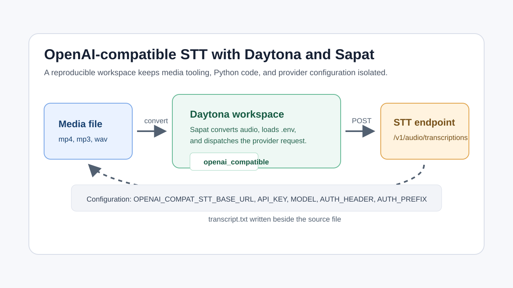

# Run OpenAI-Compatible STT in Daytona

## Introduction

Speech-to-text projects often begin with one vendor and then move to another
when cost, latency, language coverage, or data residency requirements change.
That is why an [OpenAI-compatible speech-to-text API](../definitions/20260624_definition_openai_compatible_stt_api.md)
is useful: the client can keep the same request shape while the endpoint,
model, and authentication details change through configuration.

[Sapat](https://github.com/nibzard/sapat) is a Python command-line tool that
converts video files into provider-preferred audio, sends the audio to a
speech-to-text provider, and writes the transcript beside the original file.
The provider architecture in Sapat already separates the CLI, audio conversion,
and provider-specific HTTP request logic. This guide uses that structure to run
Sapat in a [Daytona](https://www.daytona.io/) workspace with a generic
OpenAI-compatible provider.

The companion implementation for this guide is available in
[nibzard/sapat#70](https://github.com/nibzard/sapat/pull/70). While that pull
request is under review, use the public branch referenced below. After it is
merged, the same workflow can be run from the upstream Sapat repository without
the branch checkout step.



## TL;DR

- Use Daytona to keep Sapat, `ffmpeg`, Python packages, and provider
  configuration inside a disposable development workspace.
- Use Sapat's `openai_compatible` provider when your speech-to-text service
  accepts OpenAI-style `POST /v1/audio/transcriptions` requests.
- Configure the endpoint, key, model, auth header, and auth prefix through
  environment variables instead of changing Python code.
- Run the same Sapat command against local gateways, hosted inference providers,
  or internal AI platform endpoints.

## Prerequisites

You need the following before starting:

- Daytona installed and connected to a target that can create workspaces.
- Docker or another Daytona-supported target available on your machine.
- GitHub access so Daytona can clone the Sapat branch.
- A short `.mp4`, `.mp3`, `.wav`, or other media file you are allowed to
  transcribe.
- A speech-to-text endpoint that follows the OpenAI audio transcription request
  shape.
- An API key or placeholder token for that endpoint.

Do not put real API keys in Git commits, screenshots, pull requests, or public
issues. Keep secrets in `.env`, Daytona environment configuration, or another
secret manager.

## Step 1: Create the Daytona Workspace

Start the Daytona server if it is not already running:

```bash
daytona server
```

Create a workspace from the public Sapat branch used by this guide:

```bash
daytona create https://github.com/aqin236/sapat --code
```

When the workspace opens, switch to the guide branch:

```bash
git checkout codex/generic-openai-compatible-stt
```

If the companion PR has already been merged when you read this, create the
workspace from the upstream repository instead:

```bash
daytona create https://github.com/nibzard/sapat --code
```

Daytona gives you an isolated workspace for the project. That matters for
speech-to-text work because media tooling tends to bring native dependencies,
temporary audio files, provider SDKs, and per-provider environment variables.
Keeping those inside the workspace makes the setup repeatable and easier to
discard when the experiment is finished.

## Step 2: Install Project Requirements

Inside the Daytona workspace terminal, install Sapat in editable mode:

```bash
python -m pip install -e .
```

Sapat also uses `ffmpeg` for media conversion. Check whether it is already
available:

```bash
ffmpeg -version
```

If the command is missing in your workspace image, install it with your image's
package manager. For Debian-based workspace images, use:

```bash
sudo apt-get update
sudo apt-get install -y ffmpeg
```

Run a quick CLI check:

```bash
sapat --version
```

At this point the workspace has the Python CLI, the provider registry, and the
audio conversion tool that Sapat needs before it can call any transcription
API.

## Step 3: Understand the Generic Provider

The `openai_compatible` provider is intentionally small. It reuses Sapat's
shared OpenAI-compatible multipart request mixin and only supplies the pieces
that need to be configurable:

| Setting | Purpose | Example |
| --- | --- | --- |
| `OPENAI_COMPAT_STT_BASE_URL` | Base endpoint or full transcription URL | `https://api.example.com/v1` |
| `OPENAI_COMPAT_STT_API_KEY` | Token sent with the request | `example-key` |
| `OPENAI_COMPAT_STT_MODEL` | Default model when CLI uses `default` | `whisper-large-v3` |
| `OPENAI_COMPAT_STT_AUTH_HEADER` | Optional auth header name | `Authorization` |
| `OPENAI_COMPAT_STT_AUTH_PREFIX` | Optional auth value prefix | `Bearer ` |

The provider normalizes the endpoint in three common cases:

- `https://api.example.com` becomes
  `https://api.example.com/v1/audio/transcriptions`.
- `https://api.example.com/v1` becomes
  `https://api.example.com/v1/audio/transcriptions`.
- `https://api.example.com/v1/audio/transcriptions` is used as-is.

That means a team can point Sapat at a hosted provider, a company gateway, or a
local OpenAI-compatible server without creating a new provider class every
time. If a service needs a different request body, upload field, or response
shape, it should still get its own Sapat provider. The generic provider is for
services that already follow the OpenAI-style audio transcription contract.

## Step 4: Configure the Endpoint

Create a local `.env` file in the Sapat workspace. This file should stay out of
Git:

```bash
cat > .env <<'EOF'
OPENAI_COMPAT_STT_BASE_URL=https://api.example.com/v1
OPENAI_COMPAT_STT_API_KEY=replace-with-your-real-key
OPENAI_COMPAT_STT_MODEL=whisper-large-v3
OPENAI_COMPAT_STT_AUTH_HEADER=Authorization
OPENAI_COMPAT_STT_AUTH_PREFIX="Bearer "
EOF
```

If your endpoint expects a raw key with no `Bearer ` prefix, set the prefix to
an empty value:

```bash
OPENAI_COMPAT_STT_AUTH_HEADER=api-key
OPENAI_COMPAT_STT_AUTH_PREFIX=
```

The important point is that provider-specific details stay in environment
variables. The CLI command can remain stable across providers, and the same
Daytona workspace can test several compatible endpoints by changing `.env`
values.

## Step 5: Run a Transcription

Copy a short sample file into the workspace. For a first test, use a short file
that does not contain confidential conversations or customer data.

Run Sapat with the new provider:

```bash
sapat ./samples/interview.mp4 \
  --provider openai_compatible \
  --model default \
  --language en \
  --transcription-prompt "Product names: Daytona, Sapat" \
  --temperature 0 \
  --quality M
```

Sapat will convert the input to the provider's preferred audio format, send the
audio to the configured endpoint, and write a `.txt` transcript next to the
input file. If the input is `samples/interview.mp4`, the output will be
`samples/interview.txt`.

The `--model default` value tells the provider to use
`OPENAI_COMPAT_STT_MODEL`. You can also pass a model directly:

```bash
sapat ./samples/interview.mp4 \
  --provider openai_compatible \
  --model whisper-large-v3 \
  --language en
```

The prompt is useful when the recording contains product names, internal terms,
speaker names, or acronyms that a speech model might otherwise spell
incorrectly.

## Step 6: Confirm the Result

Open the generated transcript:

```bash
sed -n '1,80p' ./samples/interview.txt
```

Check the transcript for three things:

- **Completeness**: the output should cover the whole sample, not just the
  first few seconds.
- **Terminology**: product names and domain-specific terms should match your
  prompt.
- **Encoding**: punctuation and non-English characters should render correctly
  in the workspace editor.

Then confirm that Git has not picked up secrets or generated transcripts:

```bash
git status --short
```

If you see `.env`, media files, or transcript files in the output, do not commit
them. Add project-specific ignore rules or keep samples outside the repository.

## Common Issues and Troubleshooting

**Problem:** Sapat says the provider is not available.

**Solution:** The provider only registers when both
`OPENAI_COMPAT_STT_BASE_URL` and `OPENAI_COMPAT_STT_API_KEY` are set. Check that
the variables are available in the same shell that runs `sapat`.

**Problem:** The request returns `401` or `403`.

**Solution:** Confirm the API key, auth header, and prefix. Many endpoints use
`Authorization: Bearer <token>`, but some gateways use headers such as
`api-key: <token>` with no prefix.

**Problem:** The request returns `404`.

**Solution:** Check the base URL. If your provider already gives you the full
transcription URL, set `OPENAI_COMPAT_STT_BASE_URL` to that complete
`/audio/transcriptions` URL.

**Problem:** The transcript is empty.

**Solution:** First test with a very short audio file and inspect the provider's
dashboard or logs. Some OpenAI-compatible endpoints return a different JSON
shape. In that case, Sapat should get a provider-specific adapter rather than
using the generic provider.

**Problem:** Conversion fails before the API request.

**Solution:** Run `ffmpeg -version` in the Daytona workspace. Sapat must be able
to convert the input media before it can upload audio to the provider.

## When to Use a Dedicated Provider Instead

The generic provider is a practical default for endpoints that intentionally
mirror OpenAI's transcription API. It is not a replacement for every future
provider. Build a dedicated Sapat provider when a service requires:

- Async job polling instead of a single multipart upload.
- Provider-specific response fields that should be preserved.
- Extra request parameters such as diarization, timestamps, or vocabulary
  files.
- A different upload field name or content type.
- Transcript correction or post-processing through the same vendor.

This keeps the generic provider predictable while leaving room for richer
provider integrations.

## Conclusion

You now have a Daytona workspace that can run Sapat against any
OpenAI-compatible speech-to-text endpoint by changing environment variables.
The workflow is useful for AI engineers who need to compare hosted providers,
internal gateways, or local inference servers without rewriting transcription
code for every experiment.

The main development benefit is separation of concerns: Daytona keeps the
workspace reproducible, Sapat handles conversion and provider dispatch, and the
generic provider handles the common OpenAI-style transcription request. That
makes it easier to test a new speech-to-text endpoint, keep secrets out of Git,
and share a working setup with teammates.

## References

- [Sapat repository](https://github.com/nibzard/sapat)
- [Companion Sapat provider pull request](https://github.com/nibzard/sapat/pull/70)
- [Daytona documentation](https://www.daytona.io/docs/)
- [Daytona content issue: AI Transcription Tool](https://github.com/daytonaio/content/issues/13)
